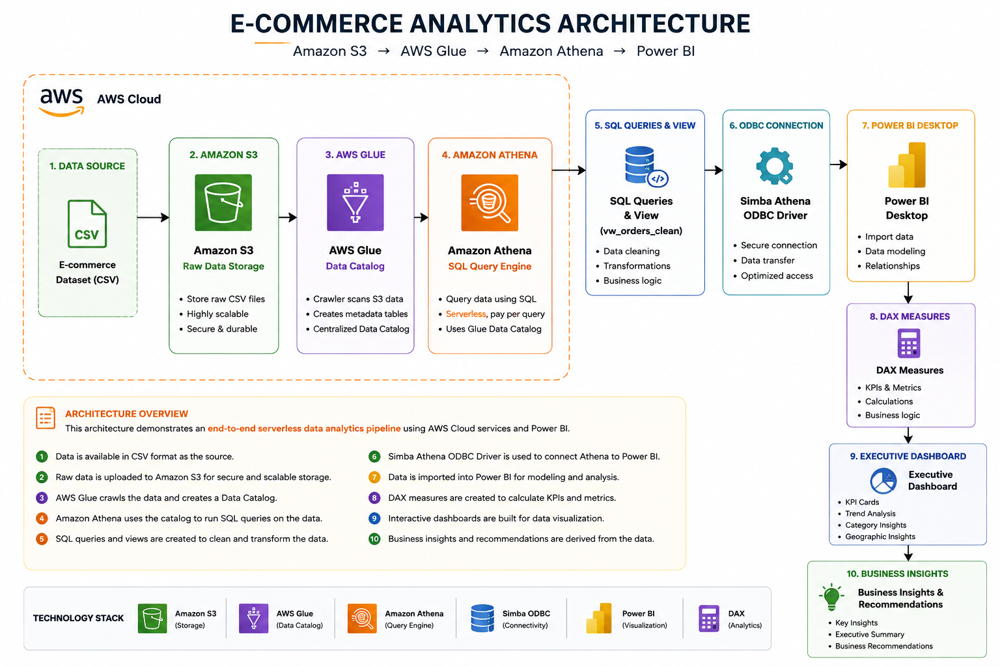

# AWS-Ecommerce-Analytics

End-to-end cloud analytics project built using Amazon S3, AWS Glue, Amazon Athena, SQL, and Power BI.

## 📌 Project Overview

This project demonstrates how to build an end-to-end cloud analytics solution using AWS services and Power BI.

The solution stores raw e-commerce data in Amazon S3, catalogs metadata using AWS Glue, performs SQL analysis using Amazon Athena, and visualizes business insights in Power BI.

The dashboard helps business users monitor sales performance, profitability, customer behavior, product categories, and regional performance while supporting data-driven decision-making.

## 🎯 Business Problem

Organizations generate large volumes of sales data every day, but raw data alone does not provide actionable insights.

The objective of this project is to build a cloud-based analytics solution that enables stakeholders to:

- Monitor sales performance
- Identify top-performing product categories
- Analyze customer purchasing behavior
- Track regional sales performance
- Measure profitability
- Support data-driven business decisions

## 🏗️ Architecture

The following architecture illustrates the complete end-to-end data analytics workflow used in this project.

## ☁️ AWS Services Used

1. Amazon S3
2. AWS Glue
3. AWS IAM
4. Amazon Athena
5. Simba ODBC Driver
6. Power BI

### 🪣 Amazon S3

Amazon S3 was used as the centralized cloud storage layer to store the raw e-commerce dataset.

**Purpose:**
- Store the raw CSV dataset
- Act as the data source for AWS Glue
- Enable serverless querying through Amazon Athena

